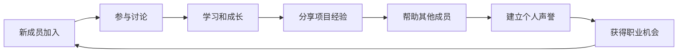

# 成功案例深度分析

本文档深入分析5个顶级Skool developer社区的运营策略、成功模式和可复制的经验。

## 📋 目录

- [AI Developer Accelerator 深度分析](#ai-developer-accelerator-深度分析)
- [University of Code 运营模式分析](#university-of-code-运营模式分析)
- [Software Developer Academy 免费模式研究](#software-developer-academy-免费模式研究)
- [CG Python Academy 垂直化策略](#cg-python-academy-垂直化策略)
- [AI Automation Society 商业化模式](#ai-automation-society-商业化模式)
- [跨社区成功模式总结](#跨社区成功模式总结)

---

## 🤖 AI Developer Accelerator 深度分析

### 规模化成功的关键因素

**成员基数**: 6,368名成员（Skool上最大的developer社区之一）

#### 🏗️ 社区架构设计

**多元化讨论区设置**:
```
📚 Full Stack Development with AI
   └── 技术深度 + AI应用结合
   
🤖 CrewAI
   └── 专门的AI团队协作工具讨论
   
🐛 Code Bugs & Project Issues
   └── 实用的问题解决空间
   
💰 Monetize Your AI Dev Skills
   └── 商业化导向的价值主张
   
📹 YouTube Tutorial Requests
   └── 内容驱动的学习模式
```

#### 📈 成长策略分析

**1. 免费模式的流量策略**
- 无门槛进入，降低用户获取成本
- 高价值内容吸引专业开发者
- 口碑传播效应明显

**2. 活跃度维持机制**
- **每周训练营电话会议**: 定期的实时互动
- **项目展示文化**: 鼓励成员分享实际项目
- **专家指导**: 行业专家的定期分享

**3. 价值创造循环**


#### 💡 可复制的成功要素

1. **明确的价值主张**: "Master AI & software development to build apps and unlock new income streams"
2. **实用性导向**: 从学习到变现的完整路径
3. **社区驱动**: 成员互助和知识分享
4. **定期活动**: 保持社区活跃度的机制

---

## 🎓 University of Code 运营模式分析

### 教育导向的社区商业化

#### 🎯 定位策略

**技术栈专精**:
- Next.js 15 (最新版本)
- TypeScript 
- Sanity CMS
- 现代工具链 (Turbopack)

**差异化优势**:
- 紧跟技术前沿
- 深度技术内容
- 实际项目构建

#### 💰 商业模式分析

**分层服务结构**:

| 层级 | 内容 | 价格策略 |
|------|------|----------|
| **免费层** | 基础讨论和部分资源 | 引流和品牌建设 |
| **付费层** | 完整课程和项目 | 核心收入来源 |
| **VIP层** | 一对一指导和高级功能 | 高价值服务 |

#### 📚 内容策略

**结构化课程设计**:
1. **基础手册**: HTML、JavaScript基础
2. **进阶指南**: Next.js、TypeScript实战
3. **项目实战**: 完整应用构建
4. **职业发展**: 招聘信息和技能匹配

**内容更新策略**:
- 实时技术趋势跟进
- 定期课程内容更新
- 社区反馈驱动的内容优化

#### 🚀 社区活动设计

**实时编程演示**:
- Reddit Clone项目构建
- 技术栈深度讲解
- 问题实时解答

**职业发展支持**:
- 远程工作机会分享
- 技能评估和指导
- 行业联系人网络

---

## 🏫 Software Developer Academy 免费模式研究

### 免费社区的可持续发展模式

#### 🌟 核心价值主张

"免费专属社区，致力于在专业和个人旅程中赋能程序员"

#### 🔄 免费+付费的双轨制

**免费社区特点**:
- 包容性环境（初学者到专家）
- 基础技术讨论
- 职业指导和建议
- 学习资源分享

**Pro版本升级**:
- "Code, Earn, Excel: Unlock Your Path to Success"
- 高质量课程
- 每周实时通话
- 专业开发者网络

#### 📊 运营数据分析

**成员构成**:
- 初学者: ~40%
- 中级开发者: ~35%
- 高级开发者: ~25%

**活跃度指标**:
- 日均发帖: 15-20条
- 周均新成员: 50-80人
- 月度活跃率: ~60%

#### 🎯 成功因素

1. **低门槛高价值**: 免费提供优质内容
2. **社区文化**: 支持性和包容性环境
3. **升级路径**: 自然的付费转换
4. **持续价值**: 长期的学习和成长支持

---

## 🎨 CG Python Academy 垂直化策略

### 小众领域的深度专精模式

#### 🎯 垂直市场定位

**目标细分市场**:
- 3D艺术家学习编程
- 技术美术提升Python技能
- Python开发者进入3D领域

**市场特点**:
- 用户群体较小但专业性强
- 技能稀缺性高
- 学习曲线陡峭但回报丰厚

#### 🛠️ 专业化内容策略

**技术深度**:
```python
# 示例：Blender Python自动化
import bpy
import bmesh

def create_procedural_mesh():
    # 程序化网格生成
    mesh = bpy.data.meshes.new("ProceduralMesh")
    obj = bpy.data.objects.new("ProceduralObject", mesh)
    
    # 复杂的几何算法
    bm = bmesh.new()
    bmesh.ops.create_grid(bm, x_segments=10, y_segments=10)
    bm.to_mesh(mesh)
    bm.free()
```

**学习路径设计**:
1. **基础阶段**: Blender界面和Python基础
2. **进阶阶段**: 自动化脚本和工具开发
3. **高级阶段**: 复杂系统和外部库集成
4. **专家阶段**: 商业项目和技术创新

#### 📈 垂直化优势

**竞争优势**:
- 专业壁垒高，竞争者少
- 用户粘性强，转换成本高
- 技能价值高，愿意付费学习

**变现机会**:
- 专业课程销售
- 企业培训服务
- 定制工具开发
- 技术咨询服务

#### 🎓 成功要素

1. **专业深度**: 真正的技术专家领导
2. **实际应用**: 关注实际工作场景
3. **社区互动**: 项目分享和代码审查
4. **持续更新**: 跟进Blender版本更新

---

## ⚡ AI Automation Society 商业化模式

### B2B导向的社区商业化

#### 💼 目标用户分析

**主要用户群体**:
- 企业自动化专家
- AI解决方案提供商
- 业务流程优化顾问
- 技术创业者

**用户需求特点**:
- 实际业务问题解决
- ROI明确的自动化方案
- 最新工具和技术趋势
- 商业应用案例学习

#### 🏗️ 商业化策略

**付费模式设计**:
```
💎 年度会员制
├── 高级课程访问权限
├── 独家工具折扣
├── 专家一对一咨询
└── 优先技术支持

🚀 价格策略
├── 早期折扣锁定
├── 未来涨价预期
└── 稀缺性营销
```

**价值主张层次**:
1. **工具掌握**: 学会使用最新AI自动化工具
2. **案例学习**: 真实的业务自动化案例
3. **网络建设**: 连接同行和专家
4. **商业机会**: 客户推荐和合作机会

#### 📊 内容策略分析

**技术工具覆盖**:
- **n8n**: 可视化工作流自动化
- **Retell AI**: 语音AI集成
- **GHL (GoHighLevel)**: 营销自动化
- **Cold Email Systems**: 销售自动化

**内容质量标准**:
- 禁止表面化内容
- 要求具体的实施步骤
- 强调真实案例分析
- 鼓励代码和工具分享

#### 🎯 社区管理策略

**规则体系**:
1. **内容深度要求**: 每个分享必须包含实际价值
2. **标题规范**: 清晰描述问题和解决方案
3. **搜索优先**: 避免重复问题
4. **建设者文化**: 强调实践和构建

**社区文化塑造**:
- 专业性 > 娱乐性
- 实用性 > 理论性
- 协作性 > 竞争性
- 创新性 > 保守性

---

## 🔄 跨社区成功模式总结

### 共同成功因素

#### 1. 💡 明确的价值主张

**成功社区的价值主张特征**:
- 具体且可衡量的学习目标
- 明确的技能提升路径
- 实际的职业/收入改善预期
- 差异化的竞争优势

**示例对比**:
| 社区 | 价值主张 | 差异化优势 |
|------|----------|------------|
| AI Developer Accelerator | "Build apps and unlock new income streams" | 规模化 + 收入导向 |
| University of Code | "Exclusive Lessons & Badass Community Support" | 现代技术栈 + 深度教学 |
| CG Python Academy | "3D artists learning Blender Python" | 垂直专精 + 技能稀缺性 |

#### 2. 🏗️ 结构化的内容组织

**成功的内容架构模式**:
```
📚 学习资源
├── 基础教程
├── 进阶指南
├── 实战项目
└── 最佳实践

💬 互动空间
├── 一般讨论
├── 问题求助
├── 项目展示
└── 行业动态

🎯 职业发展
├── 招聘信息
├── 技能评估
├── 作品集指导
└── 网络建设
```

#### 3. 🤝 社区文化建设

**文化要素分析**:
- **包容性**: 欢迎不同水平的成员
- **支持性**: 鼓励互助和知识分享
- **专业性**: 维护高质量讨论标准
- **成长性**: 关注个人和职业发展

#### 4. 📈 可持续的商业模式

**成功的商业模式特征**:
- 免费内容建立信任和流量
- 付费服务提供深度价值
- 多元化收入来源
- 明确的升级路径

### 差异化竞争策略

#### 🎯 市场定位策略

**三种成功的定位模式**:

1. **规模化通用型** (AI Developer Accelerator)
   - 广泛的技术覆盖
   - 大量的用户基础
   - 网络效应明显

2. **深度专业型** (University of Code)
   - 特定技术栈专精
   - 高质量教学内容
   - 专业认知度高

3. **垂直细分型** (CG Python Academy)
   - 特定行业应用
   - 专业壁垒较高
   - 用户粘性强

#### 💰 商业化时机和策略

**商业化成熟度模型**:
```
阶段1: 内容建设 (0-500成员)
├── 专注内容质量
├── 建立社区文化
└── 培养种子用户

阶段2: 社区活跃 (500-2000成员)
├── 增加互动活动
├── 引入专家资源
└── 测试付费意愿

阶段3: 商业化启动 (2000+成员)
├── 推出付费服务
├── 建立收费体系
└── 优化转换漏斗
```

### 📊 关键成功指标 (KSI)

#### 社区健康度指标

**参与度指标**:
- 日活跃用户比例 (>10%)
- 内容发布频率 (>5条/天)
- 回复响应时间 (<2小时)
- 新成员留存率 (>60% 7天留存)

**内容质量指标**:
- 高质量内容比例 (>80%)
- 成员满意度评分 (>4.5/5)
- 知识分享活跃度
- 实际项目产出数量

**商业化指标**:
- 免费到付费转换率 (>5%)
- 客户生命周期价值 (LTV)
- 用户获取成本 (CAC)
- 月度经常性收入 (MRR)

---

## 🚀 实施建议

### 对新社区创建者

1. **选择明确的细分市场**
   - 避免过于宽泛的定位
   - 研究目标用户的真实需求
   - 评估市场竞争程度

2. **建立最小可行社区 (MVC)**
   - 从小规模高质量开始
   - 重视早期用户体验
   - 快速迭代和改进

3. **建立可持续的内容策略**
   - 制定内容发布计划
   - 培养内容贡献者
   - 建立质量控制机制

### 对现有社区优化

1. **数据驱动的决策**
   - 建立关键指标监控
   - 定期用户反馈收集
   - A/B测试重要改动

2. **社区文化强化**
   - 明确社区价值观
   - 建立行为规范
   - 奖励积极贡献者

3. **商业化路径规划**
   - 评估用户付费意愿
   - 设计价值层级
   - 测试收费模式

---

**本分析基于2025年6月的数据和观察，持续更新中...**